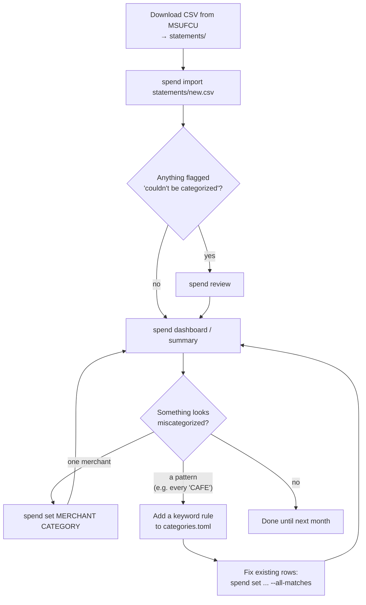

# Spending Tracker

Import MSUFCU credit card transaction CSVs (Online Banking → Download Transactions), categorize every transaction, store them by month, and chart your spending.

Everything runs locally. The only thing that ever leaves your machine is a redacted merchant name sent to [Jev](https://openrouter.ai/docs/guides/community/jev) (via OpenRouter) for stores it has never seen (see [How categorization works](#how-categorization-works)).

## First-time setup

```bash
# 1. Install dependencies (Python 3.11+, uv)
uv sync

# 2. Copy .env.example to .env, add an OpenRouter key

# 3. Download transactions from MSUFCU and put the CSV in statements/

# 4. Preview, then import everything you have
uv run spend import statements/*.csv --dry-run --no-llm   # offline preview
uv run spend import statements/*.csv

# 5. Fix whatever the LLM couldn't place, then look at the charts
uv run spend review
uv run spend dashboard
```


## Commands

All commands run as `uv run spend <command>`. Add `--help` to any of them for the full option list.

| Command | What it does | Changes data? |
|---|---|:-:|
| [`import`](#spend-import) | Read CSV export(s), categorize, store | ✅ |
| [`review`](#spend-review) | Walk through uncategorized merchants and pick categories | ✅ |
| [`set`](#spend-set) | Set one merchant's category directly | ✅ |
| [`summary`](#spend-summary) | Print one month's spending by category | — |
| [`dashboard`](#spend-dashboard) | Open the charts in your browser | — |

### `spend import`

```bash
uv run spend import FILE [FILE ...] [--dry-run] [--no-llm]
```

- Reads one or more MSUFCU CSV exports. It skips the account line at the top and uses only Date, Amount and Description. Balance and draft number are ignored.
- Removes the `Credit Card Ln Adv:` prefix from purchase descriptions.
- Categorizes each transaction (see [order](#how-categorization-works)) and saves it to `data/spending.db`.
- **Safe to repeat:** transactions are deduplicated, so overlapping downloads or re-importing the same file adds nothing twice.
- Transactions are grouped by the month they happened in, not by statement period.

| Option | Effect |
|---|---|
| `--dry-run` | Print every row with its category and source; save nothing. It **still asks the LLM** about new merchants (answers aren't remembered), so combine with `--no-llm` for a fully offline preview. |
| `--no-llm` | Use only your choices, rules and remembered merchants. Unknown merchants become `Other`. Nothing leaves your machine. |

```
$ uv run spend import statements/oct.csv
oct.csv:
  Asking Jev about 12 new merchant(s)...
  1 merchant(s) below confidence 0.6; left as 'Other' for review.
  64 transactions (2026-09 to 2026-10), 31 new.
  2 couldn't be categorized; run `spend review` to fix them.
```

### `spend review`

```bash
uv run spend review [--all]
```

Shows each merchant that ended up as `Other` (fallback), biggest total first, and asks for a category number. Your answer:

- updates **all** past transactions from that merchant, and
- is remembered as a **manual** choice that beats rules and the LLM on every future import.

| Key | Action |
|---|---|
| `1`–`13` | Set that category |
| Enter | Skip this merchant |
| `q` | Stop (choices so far are saved) |

`--all` reviews every merchant that you haven't set by hand, including ones categorized by rules or the LLM. Use it after the first import to spot-check the LLM.

```
   1. Groceries
   2. Dining
   ...
  13. Other
Enter a number to set the category, Enter to skip, q to quit.

JIFFY PUZZLE CO 5551234567 OKEMOS MI  (1x, $18.00, now: Other) > 3
  -> Shopping (1 transactions updated)
```

### `spend set`

```bash
uv run spend set MERCHANT CATEGORY [--all-matches]
```

The non-interactive version of `review`: fix one merchant without walking a list. `MERCHANT` can be part of the name, matched case-insensitively.

- One match: it's updated.
- Several matches: they're listed, and nothing changes until you use the exact name or add `--all-matches`.
- `CATEGORY` must be one from `categories.toml` (quote names with spaces: `"Gas & Transport"`).

```
$ uv run spend set kroger Shopping
KROGER EAST LANSING -> Shopping (2 transactions)

$ uv run spend set e Health
'e' matches 4 merchants:
  JIFFY PUZZLE CO OKEMOS
  ...
Use the exact name, or add --all-matches to set them all.
```

### `spend summary`

```bash
uv run spend summary [--month YYYY-MM]
```

Spending by category for one month, defaulting to the latest month with data. Payments and credits to the card are left out of the total.

```
Spending for 2026-04

  Groceries                 84.34   97.0%  (2 txns)
  Dining                     2.62    3.0%  (1 txns)
  Total                     86.96
```

### `spend dashboard`

```bash
uv run spend dashboard
```

Starts a local Streamlit app and opens it in your browser (stop with Ctrl+C):

- month picker with total spent, change vs the previous month, transaction count and biggest category
- spending by category for the month
- month-by-month stacked bars (top 7 categories, the rest grouped)
- top 10 merchants and a filterable transaction table, with each row's categorization **source**

## The monthly cycle



In practice, monthly:

1. **Download** the last month (or more; overlap is fine) into `statements/`.
2. **`spend import statements/<file>.csv`**: usually only a handful of new merchants go to the LLM.
3. **`spend review`** if the import says anything couldn't be categorized.
4. **`spend dashboard`** to look at the month.
5. **Correct** anything wrong with `spend set`, or add a rule if it's a pattern. Corrections stick, so each month needs less fixing.

> Rules in `categories.toml` apply to **future** imports. To re-label rows already stored, use `spend set` (with `--all-matches` for a pattern).

## How categorization works

Each transaction takes the first answer it gets:

1. **Your manual choices** from `review` / `set` take priority.
2. **Keyword rules** in `categories.toml`: substring match on the description. Offline and free.
3. **Merchant memory:** a merchant the LLM already categorized on an earlier import.
4. **Jev via OpenRouter,** only for merchants never seen before. Jev is TypeSafe's typed decision model: it doesn't write text, it picks one of your categories and returns a probability for each.
   - Only the Description column goes out, with any token containing 3+ digits (account/reference/phone numbers) masked. Amount, balance, draft number, dates and the account line at the top of the export are never sent.
   - Payment rows (`ACH Pmt:<account numbers>`, `HB XFR Pmt`) and `Credit Voucher` refunds are matched by local rules and never reach the model.
   - Each merchant is its own request, so one odd description can't affect another's answer. Requests run 8 at a time.
   - The answer can only be one of your categories (checked again locally). If Jev's confidence is below `JEV_MIN_CONFIDENCE` (default 0.6), or it picks `Other`, the merchant goes to `spend review` instead of being guessed.
   - Requests are restricted to zero-data-retention endpoints (`provider.zdr`).
   - Cost: about $0.00002 per merchant (input tokens only).
5. **Fallback:** anything left becomes `Other` and shows up in `spend review`.

The **source** column in the dashboard's transaction table tells you which step decided each row:

| source | Meaning |
|---|---|
| `manual` | You set it |
| `rule` | Keyword rule matched |
| `memory` | Merchant seen on an earlier import |
| `llm` | Categorized by Jev this import |
| `fallback` | Needs review |

Edit the category list, the `[descriptions]` Jev reads, or the rules in `categories.toml`. Clearer descriptions mean better Jev answers. Rule keywords are case-insensitive substrings, for example:

```toml
"Dining" = ["STARBUCKS", "CHIPOTLE", "BLUE OWL"]
```

## Troubleshooting

| Problem | Fix |
|---|---|
| `No transactions found` | Make sure it's the CSV export (not PDF) and that the file has a `"Date","Amount",...` header row. |
| `OPENROUTER_KEY is not set` | Add it to `.env`, or run with `--no-llm`. |
| `N request(s) failed` | Network or API error. Those merchants become `Other`; re-run the import later (duplicates are skipped) or use `spend review`. |
| Many merchants `below confidence` | Improve the category `[descriptions]` in `categories.toml`, or lower `JEV_MIN_CONFIDENCE` in `.env`. |
| `spend set` says no merchant matches | Use part of the name as it appears in the dashboard's description column. |

## Development

Commits are checked by [pre-commit](https://pre-commit.com) hooks: Ruff (lint + format), ty (type checking), whitespace fixes, and guards that block bank data, databases, `.env` and API keys. The tools are dev dependencies, so their versions are pinned in `uv.lock`.

```bash
uv sync                             # installs the dev tools too
uv run pre-commit install           # once per clone; covers all git worktrees
uv run pre-commit run --all-files   # check everything by hand
```

If a hook fixes files (Ruff, whitespace), the commit stops. Review the changes, `git add` them and commit again. In VS Code, the [ty extension](https://marketplace.visualstudio.com/items?itemName=astral-sh.ty) shows the same type errors the hook checks for.
