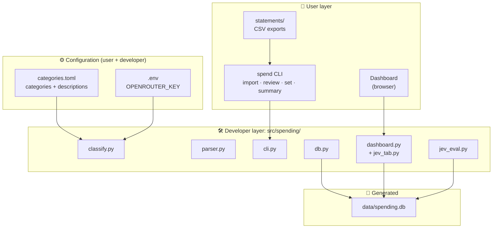
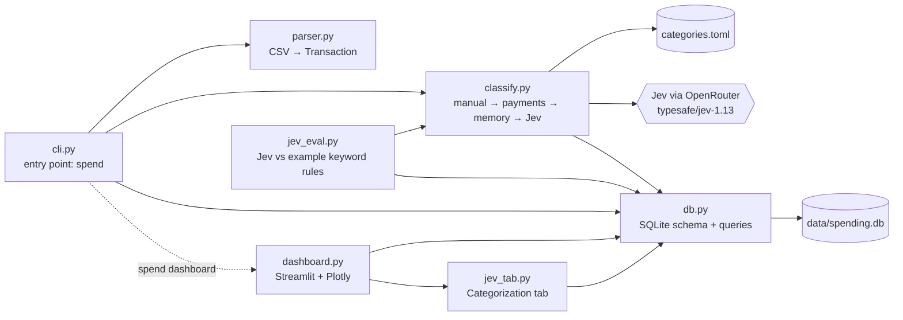
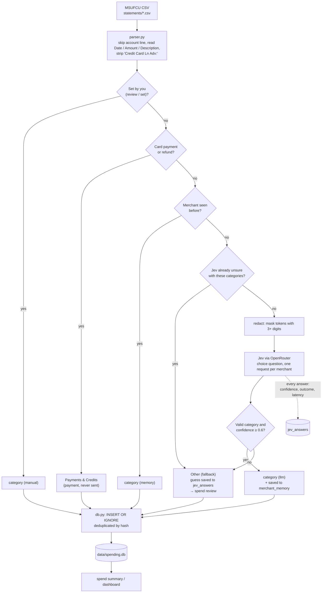
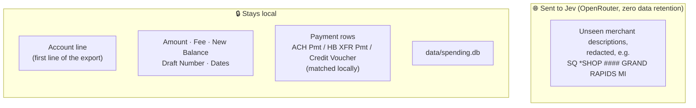
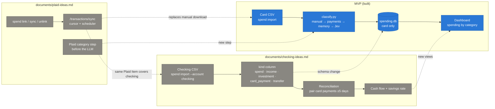
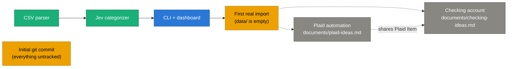

# Project Structure

Generated with the `tree` alias from `~/.bashrc` (`exa -T --icons`), limited to 3 levels:

```
 .
├──  categories.example.toml
├──  categories.toml
├──  data
├──  documents
│   ├──  checking-ideas.md
│   ├──  jev-review.md
│   └──  plaid-ideas.md
├──  pyproject.toml
├── 󰂺 README.md
├── 󰣞 src
│   └──  spending
│       ├──  __init__.py
│       ├──  classify.py
│       ├──  cli.py
│       ├──  dashboard.py
│       ├──  db.py
│       ├──  jev_eval.py
│       ├──  jev_tab.py
│       └──  parser.py
├──  statements
│   └──  l50csvdl.csv
├──  STRUCTURE.md
└──  uv.lock
```


## Who touches what

| Path | User | Developer | Status | Notes |
|---|:-:|:-:|---|---|
| `statements/` | ✅ | | **In use** | Drop MSUFCU CSV exports here. Holds `l50csvdl.csv` (Jan–Oct 2026). Git-ignored. |
| `uv run spend …` (CLI) | ✅ | | **In use** | `import`, `review`, `set`, `summary`, `dashboard` |
| Dashboard (browser) | ✅ | | **In use** | Streamlit app launched by `spend dashboard` |
| `categories.toml` | ✅ | | **In use** | Each user's own category list and the descriptions Jev reads, plus example keyword rules used only by `jev_eval`. Copied from the example at setup; users add categories with `+` in `spend review`. Git-ignored. |
| `categories.example.toml` | | ✅ | Config | The committed template for `categories.toml`. Devs change the default categories here. |
| `data/` | | | Generated | `spending.db` (SQLite) is created on first import: `transactions`, `merchant_memory`, `jev_answers` (Jev's last answer per merchant with its confidence and latency, used for review suggestions and the Categorization tab) and `jev_evals` (results of `python -m spending.jev_eval`). Git-ignored. |
| `src/spending/` | | ✅ | **Active development** | All app code (~1,400 lines) |
| `pyproject.toml` / `uv.lock` | | ✅ | Config | Dependencies and the `spend` entry point, plus dev tools (Ruff, ty, pre-commit) and their settings |
| `.pre-commit-config.yaml` | | ✅ | Config | Git pre-commit hooks: Ruff, ty, whitespace, bank-data and API-key guards |
| `.env` | | ✅ | Secret | `OPENROUTER_KEY`. Git-ignored. |
| `README.md` | ✅ | ✅ | Docs | Usage and how categorization works |
| `STRUCTURE.md` | | ✅ | Docs | This file |
| `documents/` | | ✅ | **Planning** | Feature proposals, separate from the MVP (see [Planned features](#planned-features)) |
| `documents/plaid-ideas.md` | | ✅ | Proposal | Automatic monthly pull via Plaid instead of manual CSV downloads. MSUFCU is supported (Plaid Exchange); free Trial plan covers it. |
| `documents/jev-review.md` | | ✅ | Docs | What Jev is, how `classify.py` uses it, agreement eval results, and speed/cost vs a chat LLM (with how it was estimated) |
| `documents/checking-ideas.md` | | ✅ | Proposal | Import the checking account too (rent, investing, P2P), with card-payment reconciliation to avoid double counting |
| `documents/extend-review.md` | | ✅ | Implemented | Jev's guesses in `spend review`, `+` to add a category, and `--resort` |
| `documents/resort-issues.md` | | ✅ | Resolved | Analysis of two re-sort problems found on real data: summary counts that didn't add up, and 98%-confident moves that still asked for approval |
| `documents/limit-flags.md` | | ✅ | Proposal | Fewer CLI flags: replace `review --resort` with change detection; maybe merge `--dry-run` and `--no-llm` |
| `documents/per-user-categories.md` | | ✅ | Implemented | `categories.toml` is each user's git-ignored copy of `categories.example.toml`, made at setup; how to upgrade an existing checkout |
| `.venv/` | | | Generated | Created by `uv sync` |

## Layers



## Module dependencies



## Import pipeline (what runs on `spend import`)



## Privacy boundary

Only the Description column ever leaves the machine, and payment rows never do.



## Planned features

Both proposals live in `documents/` and are **not built yet**. They extend the MVP rather than replace it: CSV import stays as the no-third-party fallback.



### Proposed changes by file

| File | Plaid | Checking |
|---|---|---|
| `src/spending/cli.py` | `link`, `sync`, `unlink` commands | `import --account`, reconciliation in `review` |
| `src/spending/parser.py` | New sibling `plaid_source.py` (Plaid → `Transaction`) | Accept checking exports; local rules for income / P2P |
| `src/spending/classify.py` | Plaid category mapping before the LLM | Never send income or P2P rows to the LLM |
| `src/spending/db.py` | `source_kind`, `external_id`, `account` columns; `plaid_items` table | `account`, `kind`, `match_id` columns |
| `src/spending/dashboard.py` | "Last synced" note | Cash flow, savings rate, account filter, reconciliation panel |
| `categories.toml` | — | Rent & Housing, Investing, Income, Transfers, People (P2P) |
| New: `payees.toml` | — | Local payee → category map for Zelle/Venmo/checks |
| `.env` / OS keyring | `PLAID_CLIENT_ID`, `PLAID_SECRET` in `.env`; `access_token` in keyring | — |

### Open questions blocking each

| Proposal | First thing to verify |
|---|---|
| Plaid | Does MSUFCU expose the **credit line** in Plaid Link, or only share/checking accounts? |
| Checking | What does a real checking CSV look like (payroll, Zelle, card-payment rows)? |

## Current status (2026-10-07)



| Legend | Meaning |
|---|---|
| 🟢 Active | Recently changed (PDF → CSV switch, payment redaction) and verified on the real export |
| 🔵 Ready | Built and smoke-tested on sample data |
| 🟡 Pending | Next step |
| ⚪ Idea | Proposal written, not started (`documents/`) |
