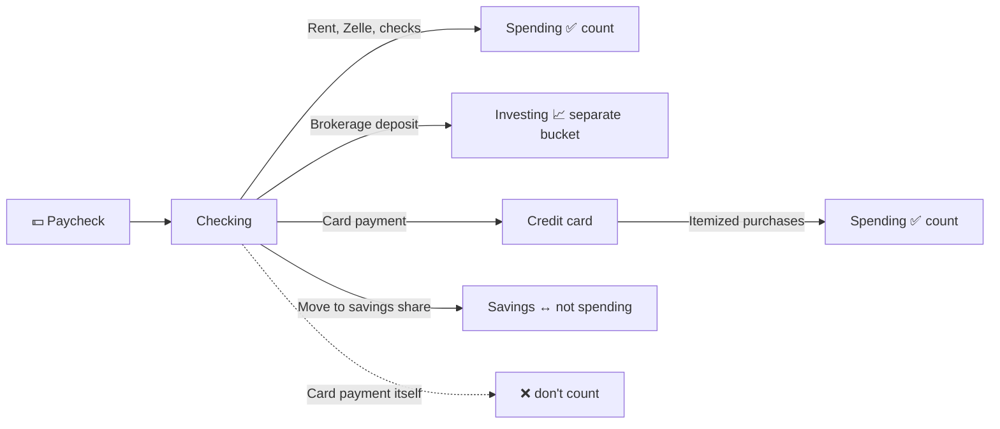
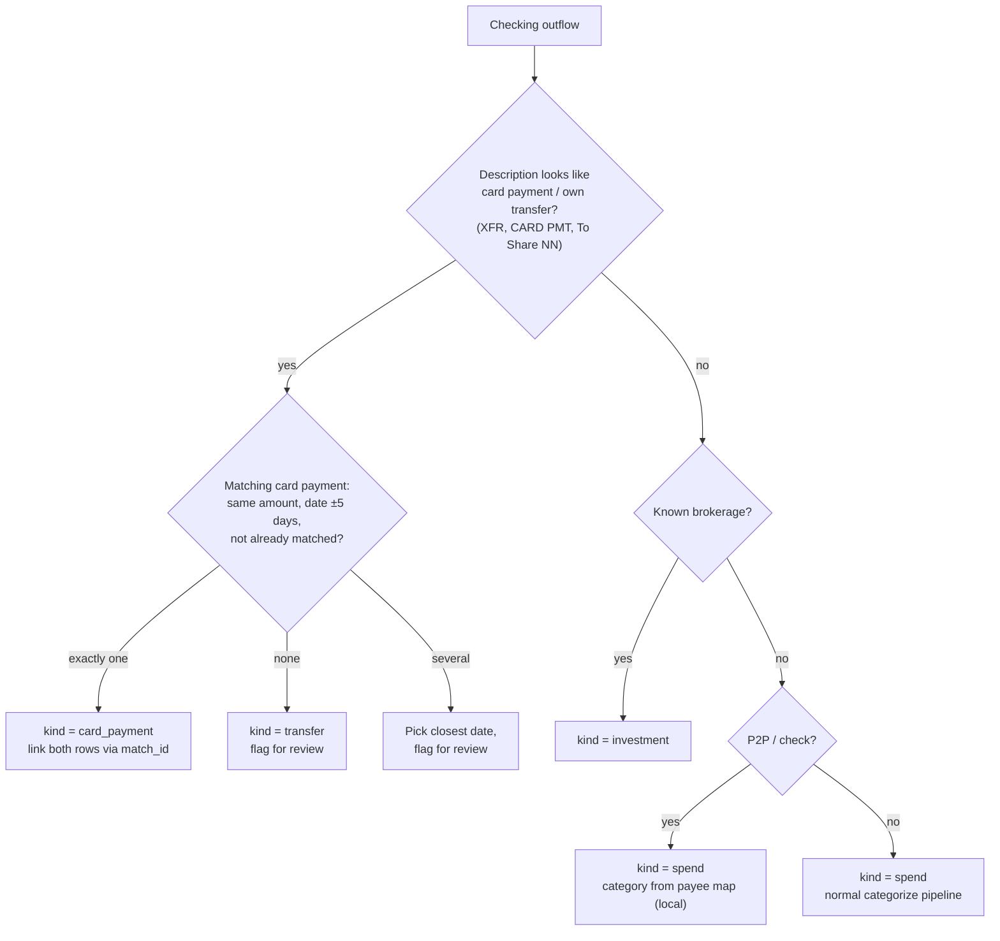

# Checking Ideas

> **Status:** Proposal ([#7](https://github.com/alessandrofelici/spending-tracker/issues/7)), separate from the MVP (credit card only). Nothing here is built yet.
> **Goal:** Show *all* money going out, including what never touches the credit card, without counting anything twice.

## Motivation
- Want to account for money which goes through checking account
    - Examples: Stock investments, rent, direct payments
    - Today the dashboard only sees card purchases. Rent, brokerage deposits, Zelle/Venmo, checks and bills paid straight from checking are invisible. These are often the biggest monthly items.
    - With income also visible, we can show **cash flow**: income − spending − investing = what's left over, and the savings rate.

## Limitations
- Security
  - Checking data is more sensitive than card data: paychecks (employer, salary), transfers to people (**names of private individuals** in Zelle/Venmo descriptions), check numbers, and account/routing numbers in ACH descriptions.
  - See [Security & privacy](#security--privacy) for rules.
- Algorithm to assess what was covered in credit card vs not; might be missing details
  - Core risk: **double counting.** A $300 card purchase is already counted. The later $300 checking → card payment must not be counted again.
  - See [Reconciliation](#reconciliation-card-vs-checking) for the matching approach and its edge cases.

## The double-counting problem



Rule: **spending = card purchases + checking outflows that aren't transfers, card payments or investments.**

## Data model

Add an account dimension and a *kind* that sits above the category:

| kind | Counts as spending? | Examples |
|---|---|---|
| `spend` | ✅ | Card purchases, rent, utilities paid from checking, Zelle to a landlord |
| `income` | — (shown as inflow) | Payroll, refunds to checking, interest |
| `investment` | ❌ (own bucket) | Robinhood/Fidelity/Schwab deposits |
| `card_payment` | ❌ | Checking → MSUFCU card (`HB XFR Pmt`, `ACH Pmt`) |
| `transfer` | ❌ | Checking ↔ savings share, between own accounts |

```sql
ALTER TABLE transactions ADD COLUMN account TEXT NOT NULL DEFAULT 'credit';  -- credit | checking | savings
ALTER TABLE transactions ADD COLUMN kind    TEXT NOT NULL DEFAULT 'spend';   -- spend | income | investment | card_payment | transfer
ALTER TABLE transactions ADD COLUMN match_id TEXT;  -- id of the paired row on the other account, if any
```

Existing card rows in "Payments & Credits" become `kind = card_payment` (payments) or stay `spend` with a negative amount (refunds/vouchers). New categories: **Rent & Housing**, **Investing**, **Income**, **Transfers**, **People (P2P)**.

## Reconciliation: card vs checking



From the real card export, the card side of each pair already looks like this:

- `HB XFR Pmt:From Share 05` is a home-banking transfer from an MSUFCU share. The checking side should show a matching "to loan/card" outflow on the same day.
- `ACH Pmt:<numbers>` is likely a payment pulled from an external bank. If that bank isn't imported, there's no checking-side row, and that's fine.

Edge cases to handle:

| Case | Handling |
|---|---|
| Card paid from an account we don't import | Card-side payment stays unmatched; nothing to exclude. Not an error. |
| Partial or split payments ($200 + $100 for one bill) | Match by amount only; never sum several rows. Unmatched rows get flagged, not guessed. |
| Two equal payments in the same window | Greedy match by closest date; flag for review |
| Imports covering different date ranges | Leave unmatched rows near the edges of the date range as "pending match" and re-run matching on each import |
| Refund to checking for a card purchase | `income` on checking; the card purchase is unaffected |

## Security & privacy

Builds on the MVP rules (only redacted descriptions go to the LLM, data stays local):

| Data | Rule |
|---|---|
| Payroll / income rows | **Never sent to the LLM.** Classified by local rules (`kind = income`). |
| Zelle / Venmo / Cash App / checks | **Never sent to the LLM** (they contain private individuals' names). Categorized from a local `payees.toml` map (e.g. landlord → Rent & Housing); unknown payees go to `spend review`. |
| Card payments and own transfers | Local rules only (as today for `ACH Pmt` / `HB XFR Pmt`) |
| Account / routing numbers | Masked by the existing 3+ digit redaction; never stored separately |
| Balance column | Not stored (same as the card import) |
| `data/spending.db` | Now holds income data: `chmod 600`, keep it git-ignored. Optionally encrypt with SQLCipher if the machine is shared. |

What the LLM would still see: redacted merchant names from checking debit-card purchases and online bill pays, the same kind of data it sees today.

## Data source

- **Short term:** the MSUFCU "Download Transactions" CSV for the checking share. It is assumed to have the same columns as the card export; **verify with one real file.** The parser already skips the account line at the top.
- **Long term:** the same Plaid Item as in [plaid-ideas.md](plaid-ideas.md) covers checking at no extra Item cost. Plaid's `TRANSFER_IN` / `TRANSFER_OUT` / `INCOME` categories would make kind detection much easier.

## Dashboard additions

- **Cash flow per month:** income vs spending vs investing, with the net left over.
- **Savings rate:** (income − spending) / income, as a stat tile with month-over-month change.
- **Account filter:** credit / checking / all.
- **Reconciliation panel:** unmatched card payments and flagged transfers, so the user can confirm or fix them.

## Phases

1. **Kinds on the existing card data:** add `account` and `kind` columns, migrate current rows. No new data source yet.
2. **Checking CSV import:** `spend import --account checking`, local rules for income/P2P/transfers, `payees.toml`.
3. **Reconciliation:** the matching algorithm, `match_id`, and a review step in `spend review`.
4. **Dashboard:** cash flow chart, savings rate, account filter, reconciliation panel.
5. *(Optional)* Switch the source to Plaid.

## Open questions

- [ ] Does the checking CSV export have the same columns as the card export? What do payroll, Zelle and card-payment rows look like?
- [ ] Which account pays the card: the `Share 05` in `HB XFR Pmt:From Share 05`, or an external bank (the `ACH Pmt` rows)?
- [ ] Should investments count toward "money out" on the main total, or only in the cash flow view? (Proposed: cash flow view only.)
- [ ] Does the team want income shown at all, or only outflows? It is the most sensitive data here.
