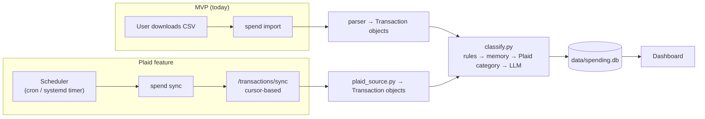
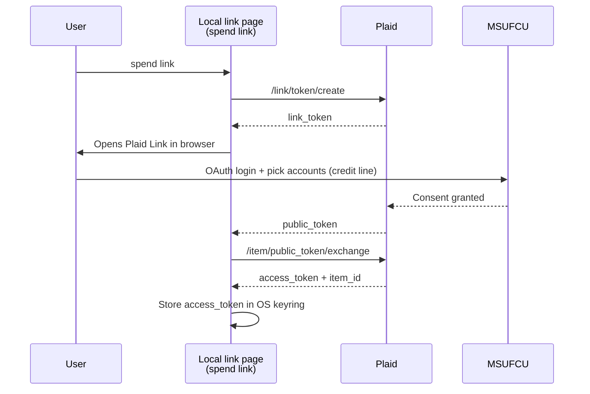
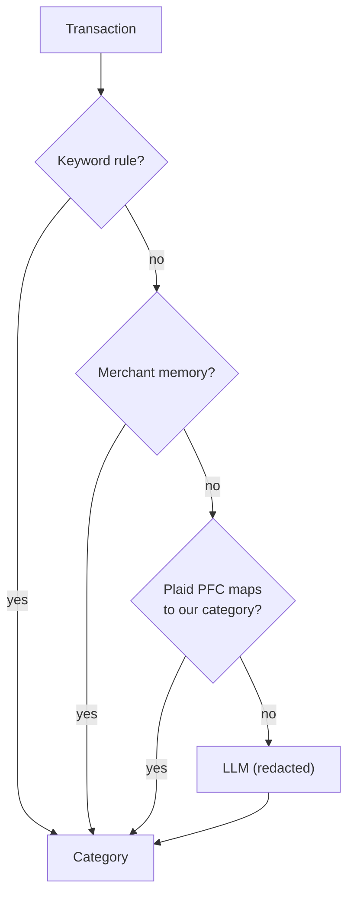

# Plaid Ideas

> **Status:** Proposal, separate from the MVP (CSV import). Nothing here is built yet.
> **Goal:** Replace the manual "download CSV → `spend import`" step with an automatic monthly pull of transactions.

## Automation
- Retrieve statement monthly
  - Pull transactions automatically through Plaid's `/transactions/sync` instead of downloading a CSV by hand.
  - Run on a schedule (monthly, or weekly so the dashboard stays current), then hand the new rows to the existing categorize → store pipeline.
  - The same connection can later cover the checking account (see [checking-ideas.md](checking-ideas.md)).

## Limitations
- Is MSUFCU offered?
  - **Yes.** MSUFCU has been on **Plaid Exchange** since **December 2021**. It's an OAuth-based API connection, so we never handle the online banking password ([Plaid customer story](https://plaid.com/customer-stories/msufcu/)).
  - **Still to verify:** that the credit line (the `L50 CREDITLINE` account in the CSV export) appears in the account picker during Link, not just share/checking accounts. Plaid's Transactions product supports both credit and depository accounts, but which accounts show up is up to the institution.
- **Cost:** Plaid teams created on or after April 15, 2026 (US/Canada) get a free **Trial plan** with real production data, capped at **10 Items**, with Transactions included. Pick "Personal use" at signup. This replaced "Limited Production" for new teams. One Item = one bank login, so MSUFCU uses 1 of the 10 no matter how many accounts it covers.
- **Data exposure:** Plaid gets read access to every account selected in Link. That is a much larger trust boundary than a CSV you downloaded yourself.
- **Access token = credential.** Anyone holding the `access_token` plus our client secret can read the accounts. It must be stored like a password (see Security).
- **Link needs a browser.** Connecting the account requires Plaid Link, a web widget, once per Item and again whenever MSUFCU requires re-consent. We need a minimal local page for that.
- **No more "statement month".** Plaid returns individual transactions, not statements. The MVP already groups by transaction month, so this is fine.

## How it would fit



## One-time setup flow



## Sync design

- **Endpoint:** `/transactions/sync`. The first call has no cursor. Save `next_cursor` and keep paging while `has_more` is true. Each response contains `added`, `modified` and `removed` lists.
- **History:** set `days_requested` when creating the Link token. The default is 90 days and the maximum is 730. Use 730 on first connect to backfill.
- **Pending transactions:** store only posted ones (`pending == false`). Pending charges change amount or disappear.
- **Removals:** apply `removed` (delete by `transaction_id`) and `modified` (update amount, date or description, but keep a manually set category).
- **Webhook not needed:** a local tool can't receive webhooks without exposing a port. Polling on a schedule is simpler; `SYNC_UPDATES_AVAILABLE` only matters if this ever becomes a hosted service.
- **Amount sign:** Plaid uses positive = money out, which matches our convention, so no flip is needed. Verify against one known refund before trusting it.

### Schema changes

```sql
ALTER TABLE transactions ADD COLUMN source_kind TEXT NOT NULL DEFAULT 'csv';  -- csv | plaid
ALTER TABLE transactions ADD COLUMN external_id TEXT;                           -- Plaid transaction_id
ALTER TABLE transactions ADD COLUMN account TEXT NOT NULL DEFAULT 'credit';     -- credit | checking | ...

CREATE TABLE plaid_items (
    item_id     TEXT PRIMARY KEY,
    institution TEXT NOT NULL,
    cursor      TEXT,              -- last next_cursor; NULL = never synced
    last_synced TEXT
    -- access_token is NOT stored here; it lives in the OS keyring
);
```

### Overlap with CSV-imported history

CSV rows and Plaid rows get different ids, so importing both would double count. Options:

1. **Cutover date (recommended):** `spend sync` ignores Plaid transactions dated on or before the last CSV transaction. Simple and predictable.
2. Fuzzy match on (date ±1 day, amount, normalized merchant) and attach `external_id` to the existing row. More work, and it fails when two identical charges fall on nearby days.

### Categorization: free extra signal

Plaid returns `personal_finance_category` (about 95% fill rate) on every transaction. Add it as a step **before** the LLM. That cuts LLM calls and means less data leaves the machine.



Draft mapping. New Plaid customers get **PFCv2** by default (since December 3, 2025), so check these names against the v2 taxonomy before coding:

| Plaid PFC (primary / detailed) | Our category |
|---|---|
| `FOOD_AND_DRINK_GROCERIES` | Groceries |
| `FOOD_AND_DRINK` (other) | Dining |
| `GENERAL_MERCHANDISE` | Shopping |
| `TRANSPORTATION` | Gas & Transport |
| `TRAVEL` | Travel |
| `RENT_AND_UTILITIES` | Bills & Utilities |
| `ENTERTAINMENT` | Entertainment |
| `MEDICAL` | Health |
| `BANK_FEES` | Fees & Interest |
| `LOAN_PAYMENTS`, `TRANSFER_IN`, `TRANSFER_OUT` | Payments & Credits |
| anything else | fall through to LLM |

## Security

| Concern | Mitigation |
|---|---|
| `PLAID_CLIENT_ID` / `PLAID_SECRET` | `.env` (already git-ignored), same as `OPENROUTER_KEY` |
| `access_token` | OS keyring (`keyring` package), never in SQLite, `.env` or logs |
| Over-broad access | In Link, select only the accounts we need; request only the `transactions` product |
| Lost or retired machine | `spend unlink` calls `/item/remove`, which revokes the token at Plaid |
| Data sent to the LLM | Unchanged: only redacted merchant names, and fewer of them thanks to the PFC step |

## Proposed CLI

| Command | Does |
|---|---|
| `spend link` | One-time Plaid Link in the browser; stores the token |
| `spend sync [--since YYYY-MM-DD]` | Pulls new transactions, categorizes and stores them |
| `spend unlink` | Revokes the Item at Plaid and deletes the local token |

Scheduling: a `systemd --user` timer or crontab entry running `uv run spend sync` monthly. WSL only runs while it's open, so either use Windows Task Scheduler calling `wsl -e ...`, or sync whenever the dashboard is opened.

## Phases

1. **Sandbox spike:** create a Plaid account, run `/transactions/sync` against Sandbox test credentials, and write `plaid_source.py` that maps Plaid results to `Transaction`.
2. **Real connection (Trial plan):** link MSUFCU and confirm the credit line is selectable (this closes the open question). Backfill 730 days.
3. **Merge into pipeline:** schema changes, cutover logic, PFC mapping step, `spend sync`.
4. **Schedule it:** timer or cron, plus a "last synced" note on the dashboard.

## Open questions

- [ ] Does MSUFCU expose the credit line through Plaid, or only share/checking accounts?
- [ ] How long does MSUFCU's OAuth consent last before it needs re-linking?
- [ ] Are the Trial plan limits enough long term (10 Items; check for request caps)?
- [ ] Should Plaid replace CSV import entirely, or should CSV stay as a fallback? (Recommend keeping it: no account, no third party.)

## Sources

- [MSUFCU × Plaid Exchange customer story](https://plaid.com/customer-stories/msufcu/)
- [Plaid Transactions docs](https://plaid.com/docs/transactions/)
- [Plaid: Can I use Plaid for free?](https://support.plaid.com/hc/en-us/articles/16194695660311-Can-I-use-Plaid-for-free)
- [Plaid release notes: Trial plans replace Limited Production (Apr 2026)](https://releases.sh/release/rel_UMWHsPtT6Jgz9w90BoAGP-plaid-cli-launches-trial-plans-replace-limited-production)
